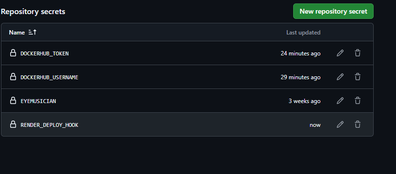
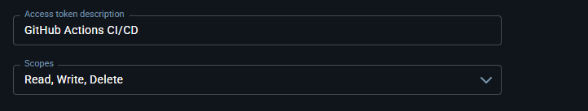
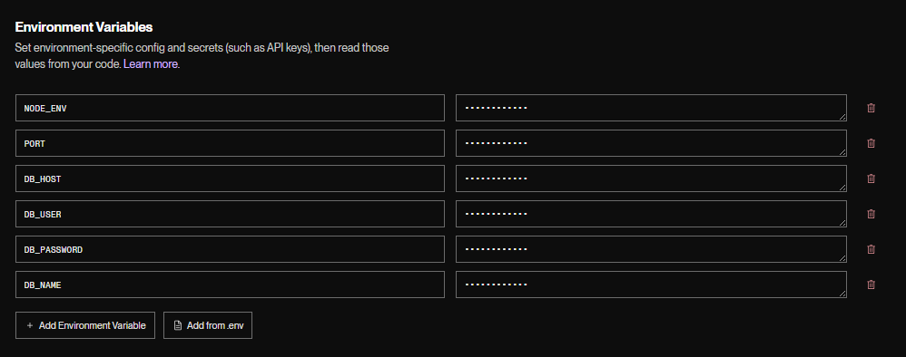
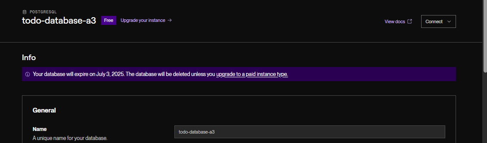
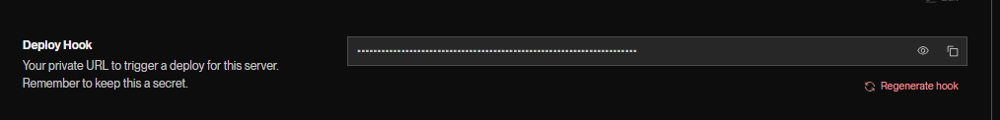
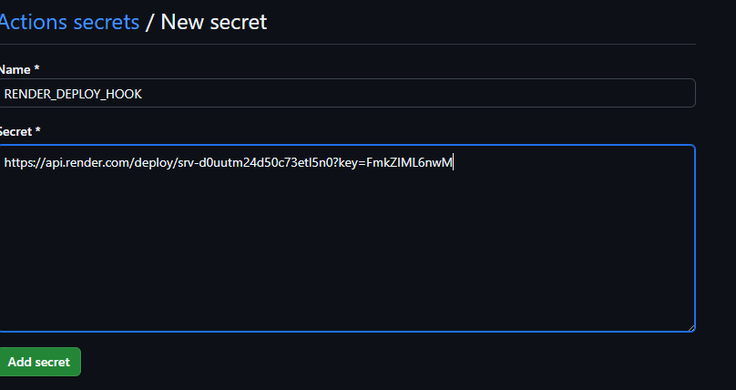
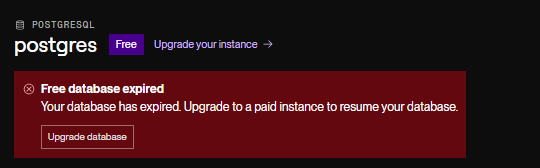
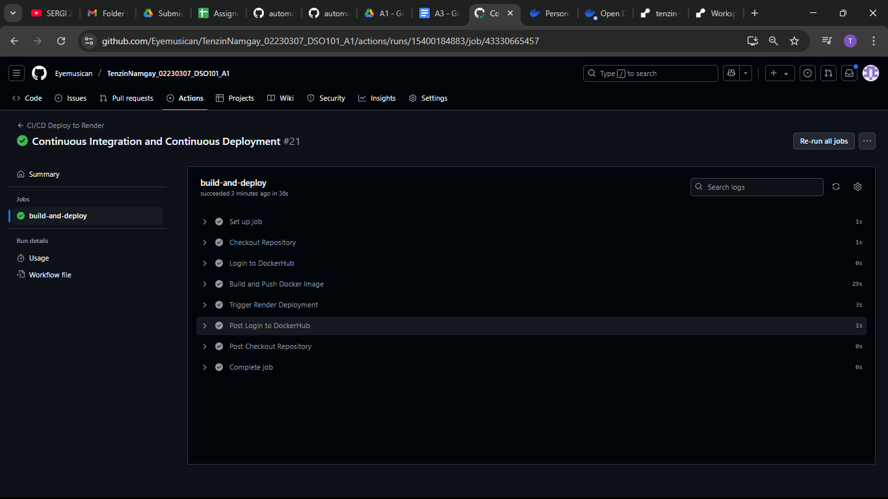
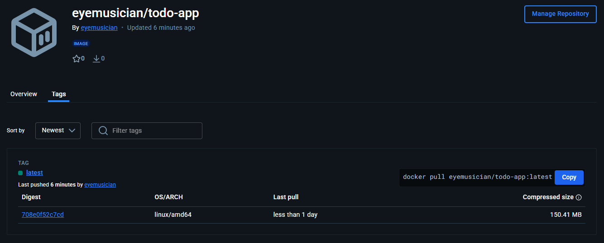
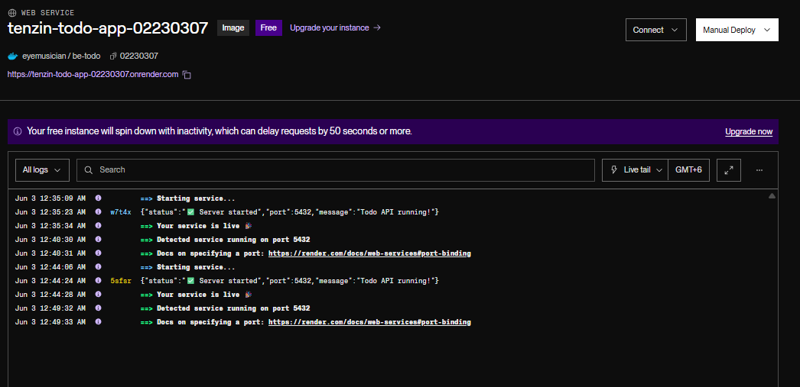

## Assignment 3 - Continuous Integration and Continuous Deployment 

This assignment shows a complete CI/CD pipeline using GitHub Actions to automate the build, Docker containerization, and deployment of a TODO app. It connects GitHub, DockerHub, and Render for smooth code-to-deployment automation.

### Overview

1. **Application** : Node.js TODO application (single combined app)

2. **Repository**: https://github.com/Eyemusican/TenzinNamgay_02230307_DSO101_A1

3. **CI/CD Tool** : GitHub Actions

4. **Containerization**: Docker

5. **Registry** : DockerHub (eyemusician/todo-app)

6. **Deployment Platform** : Render.com

7. **Service Name**: tenzin-todo-app-02230307

### Set-up 

1. Repository Setup and Verification

2. Dockerfile Configuration

### Main set-up for Assignment 3
####  GitHub Actions Workflow Creation

I Created .github/workflows/deploy.yml with automated pipeline:

```
name: CI/CD Deploy to Render

on:
  push:
    branches: ["main"]

jobs:
  build-and-deploy:
    runs-on: ubuntu-latest

    steps:
      # 1. Checkout code
      - name: Checkout Repository
        uses: actions/checkout@v4

      # 2. Login to DockerHub
      - name: Login to DockerHub
        uses: docker/login-action@v3
        with:
          username: ${{ secrets.DOCKERHUB_USERNAME }}
          password: ${{ secrets.DOCKERHUB_TOKEN }}

      # 3. Build & Push Docker Image
      - name: Build and Push Docker Image
        run: |
          cd to-do
          docker build -t ${{ secrets.DOCKERHUB_USERNAME }}/todo-app:latest .
          docker push ${{ secrets.DOCKERHUB_USERNAME }}/todo-app:latest

      # 4. Deploy to Render.com (via webhook)
      - name: Trigger Render Deployment
        run: |
          curl -X POST ${{ secrets.RENDER_DEPLOY_HOOK }}

```

**Trigger** : Push to main branch

**Checkout Repository** : Uses actions/checkout@v4

**DockerHub Login** : Uses docker/login-action@v3 with stored secrets

**Build and Push** :

1. Navigate to **to-do/ directory**

2. Build image as **eyemusician/todo-app:latest**

3. Push to DockerHub registry

***Deploy Trigger*** : HTTP POST request sent to Render deploy webhook


#### GitHub Secrets Configuration : 

I Set up repository secrets under :

  Settings → Secrets and Variables → Actions:



I got the token from docker hub under :

 Account settings → Generate new tokens 

 


#### Render.com Service Setup


I Created web service: tenzin-todo-app-02230307 with deploy from existing image: **eyemusician/todo-app:latest**

Environment variables configured: 



I had to recreate Database connection variables  due to expired free database, named it as todo-database-a3 : 



I Enabled deploy hook ( AT Render ) : 



for automated deployments that will used in GitHub Secrets Configuration : 




#### Pipeline Execution and Testing

I made commits to the main branch to trigger the automated CI/CD pipeline. Then, I monitored the workflow execution through the GitHub Actions tab to ensure each step was running as expected. After verifying the successful completion of all pipeline stages, I confirmed that the application was live and successfully deployed on the Render platform.


### Challenges Faced

I encountered database connectivity issues because the free PostgreSQL database used in a previous assignment had expired. The error displayed a "Free database expired" warning along with a 13-day deletion notice. 



To resolve this, I created a new free PostgreSQL database on Render and updated the environment variables with the new connection credentials.

#### DockerHub Image Not Found Initially
While setting up the Render service, I received a "No public image found" warning for eyemusician/todo-app:latest. This occurred because the Docker image had not been created yet, as the GitHub Actions workflow had not run successfully at that point.

To fix this, I completed the full CI/CD pipeline setup, after which the automated workflow ran properly and built and pushed the required image to DockerHub.


### GitHub Actions Workflow Success : 



### DockerHub Image Push Verification




### Render Deployment Success




#### Live Application
Deployment URL: https://tenzin-todo-app-02230307.onrender.com

The application is successfully deployed and accessible via the above URL, demonstrating the complete CI/CD pipeline functionality.

#### Conclusion 

I have successfully completed Assignment 3 by setting up a GitHub Actions workflow to automate building and pushing a Docker container for my to-do app, and deploying it on Render.com. The pipeline runs smoothly on pushes to the main branch, and the application is live on Render. This process helped me understand CI/CD automation, containerization, and cloud deployment.


